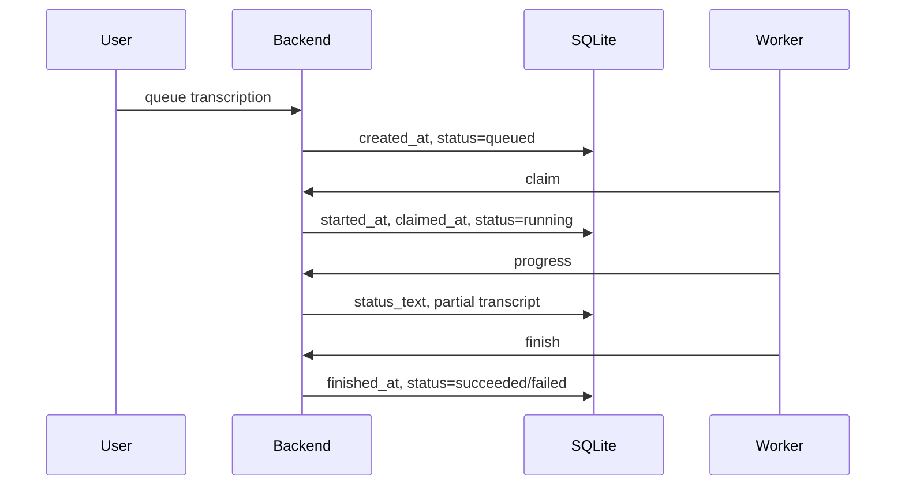
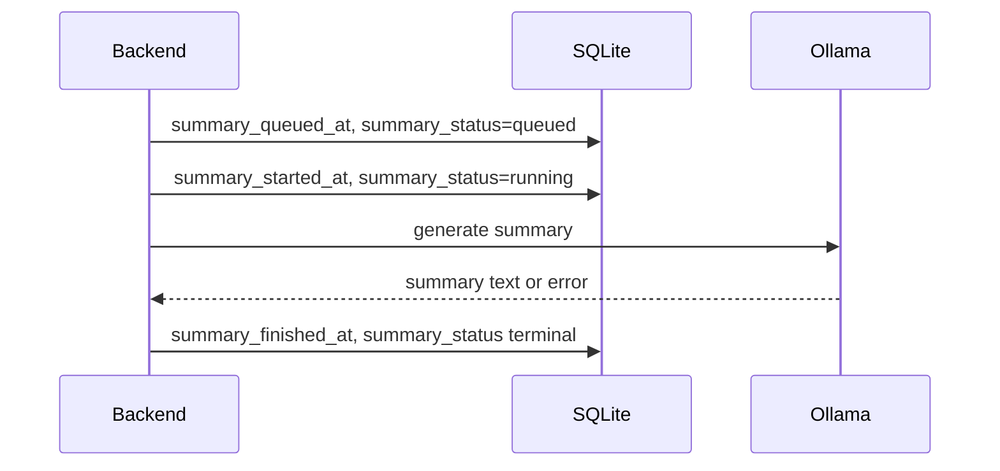
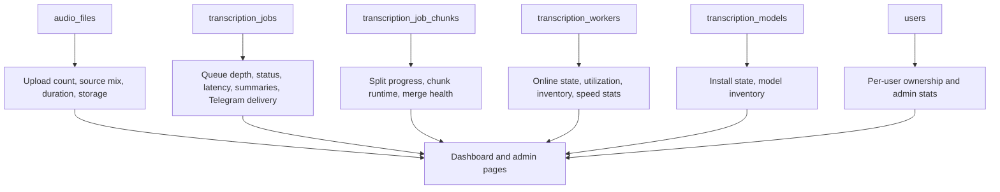

# ASR UI Analytics

This document describes the analytics currently available in ASR UI, where the metrics come from, and which additional metrics are useful for operations.

## Analytics Scope

ASR UI analytics are operational analytics, not product tracking. The current implementation derives metrics from database state, file sizes, timestamps, worker heartbeats, model inventories, and job outputs. There is no separate event warehouse or telemetry exporter in the codebase.

## Current Metric Sources

| Source | Data | Main Consumers |
| --- | --- | --- |
| `audio_files` | file count, source, size, duration, owner, project | Dashboard, Files, user stats |
| `transcription_jobs` | job status, queue/start/finish timestamps, outputs, summaries, Telegram delivery | Dashboard, Jobs, Transcriptions, summaries |
| `transcription_job_chunks` | split chunk status, worker, timings, time ranges | Jobs, worker/model performance stats, split merge |
| `transcription_models` | model provider, variant, install status, bytes, path | Models, Dashboard |
| `transcription_workers` | heartbeat, status, counters, speed stats, inventory, install requests | Workers, Dashboard, scheduler |
| `users` | role and ownership | User management, user stats |
| `app_settings` | cleanup, Telegram, summarization, Whisper settings | Settings |
| filesystem | output sizes, model sizes, upload sizes | Dashboard, Models, Files |

## Dashboard Metrics

The frontend dashboard computes these metrics client-side after fetching API data:

| Metric | Formula |
| --- | --- |
| Audio Files | `count(audio_files)` visible to the current user |
| Audio Duration | `sum(audio_files.duration_seconds)` |
| Audio Storage | `sum(audio_files.size_bytes)` |
| Finished Transcriptions | `count(transcription_jobs where status="succeeded")` |
| Transcript Storage | sum of TXT, JSON, SRT, and VTT output sizes for succeeded jobs |
| Active Jobs | active transcription jobs plus active summary jobs |
| Active Transcriptions | `status in ("queued", "running")` |
| Active Summaries | `summary_status in ("queued", "running")` |
| Completed Summaries | jobs with `summary_status="succeeded"` and `summary_text` |
| Summary Coverage | completed summaries divided by finished transcriptions |
| Summary Output Words | word count across completed summary text |
| Average Summary Words | summary output words divided by completed summaries |
| Failed Summaries | `summary_status="failed"` |
| Installed Models | installed transcription models plus installed Ollama summary models |
| Available Workers | online, accepted workers with `status="idle"` and `current_job_count=0` |
| Online Workers | workers whose heartbeat is still fresh |

## Admin Stats APIs

### User Stats

`GET /api/v1/users/stats` returns per-user aggregates:

| Field | Meaning |
| --- | --- |
| `audio_file_count` | total files owned by user |
| `web_audio_count` | files where source is web or empty |
| `telegram_audio_count` | files where source is Telegram |
| `transcription_count` | total transcription jobs owned by user |
| `running_job_count` | running transcription jobs owned by user |

### Model Stats

`GET /api/v1/models/stats` returns per-model/per-worker performance samples from successful normal jobs and successful split chunks.

| Field | Meaning |
| --- | --- |
| `completed_job_count` | completed normal jobs or chunks included in the sample |
| `total_audio_seconds` | total audio duration processed |
| `total_runtime_seconds` | total wall-clock processing time |
| `runtime_per_audio_hour_seconds` | seconds of runtime needed for one hour of audio |
| `median_runtime_per_audio_hour_seconds` | median per-sample runtime per audio hour |
| `last_completed_at` | latest sample finish timestamp |

The scheduler also stores worker-level per-model speed samples in `transcription_workers.model_speed_stats_json`. These samples are used to size split chunks according to worker speed.

## Recommended Operational Metrics

These metrics can be computed from the current schema without new tables:

| Metric | Query Source | Why It Matters |
| --- | --- | --- |
| Queue depth by status | `transcription_jobs.status`, `summary_status` | Shows backlog and stuck jobs |
| Queue wait time | `started_at - created_at` or `summary_started_at - summary_queued_at` | Detects under-provisioned workers or slow summarization |
| Runtime | `finished_at - started_at` and summary equivalents | Tracks system performance |
| Real-time factor | `runtime_seconds / audio_seconds` | Compares ASR speed across workers/models |
| Audio throughput | `sum(audio_seconds) per day/week` | Capacity planning |
| Failure rate | failed jobs divided by terminal jobs | Reliability signal |
| Cancellation rate | cancelled jobs divided by terminal jobs | UX or queue contention signal |
| Split merge success rate | split parent jobs with `split_status="merged"` divided by split jobs | Distributed worker health |
| Worker freshness | `now - last_heartbeat_at` | Detects offline workers |
| Worker utilization | running workers divided by online accepted workers | Capacity signal |
| Model install progress | `downloaded_bytes / total_bytes` | Install visibility |
| Telegram delivery failures | non-empty `telegram_result_error` or `telegram_summary_error` | Bot reliability |
| Summary coverage | summaries succeeded divided by transcriptions succeeded | Summarization adoption |
| Summary failure rate | failed summary jobs divided by terminal summary jobs | Ollama/model reliability |
| Storage growth | upload/output/model bytes over time | Disk capacity planning |

## Job Status Taxonomy

### Transcription Jobs

Common `transcription_jobs.status` values:

| Status | Meaning |
| --- | --- |
| `queued` | Waiting for a capable worker or split chunks |
| `running` | Claimed by a worker or split chunks are running |
| `succeeded` | Transcript outputs were created |
| `failed` | Job or split chunk failed |
| `cancelled` | User cancellation completed |

### Summary Jobs

Common `summary_status` values:

| Status | Meaning |
| --- | --- |
| `idle` | No summary requested/generated |
| `queued` | Waiting for summarizer |
| `running` | Ollama generation in progress |
| `succeeded` | `summary_text` is available |
| `failed` | Summary generation failed |
| `cancelled` | Summary cancellation completed |

### Split Jobs

`split_status` tracks the parent job state:

| Status | Meaning |
| --- | --- |
| `queued` | Chunk records were created |
| `running` | At least one chunk is running or completed |
| `merged` | All chunks succeeded and parent outputs were merged |
| `failed` | One or more chunks failed |
| `cancelled` | Cancellation completed |

## Sequence Metrics

### Normal Transcription



Useful derived timings:

| Metric | Formula |
| --- | --- |
| Queue wait | `started_at - created_at` |
| Claim age | `claimed_at - created_at` |
| Runtime | `finished_at - started_at` |
| Total latency | `finished_at - created_at` |
| Real-time factor | `runtime / audio_file.duration_seconds` |

### Summary Generation



Useful derived timings:

| Metric | Formula |
| --- | --- |
| Summary queue wait | `summary_started_at - summary_queued_at` |
| Summary runtime | `summary_finished_at - summary_started_at` |
| Summary total latency | `summary_finished_at - summary_queued_at` |

## Database Analytics Diagram



## Example SQL Queries

Queue depth by job status:

```sql
select status, count(*) as count
from transcription_jobs
group by status
order by status;
```

Summary status distribution:

```sql
select summary_status, count(*) as count
from transcription_jobs
group by summary_status
order by summary_status;
```

Average transcription queue wait and runtime:

```sql
select
  avg(strftime('%s', started_at) - strftime('%s', created_at)) as avg_queue_wait_seconds,
  avg(strftime('%s', finished_at) - strftime('%s', started_at)) as avg_runtime_seconds
from transcription_jobs
where started_at is not null
  and finished_at is not null;
```

Worker throughput by model:

```sql
select
  m.variant,
  j.worker_name_snapshot,
  count(*) as completed_jobs,
  sum(a.duration_seconds) as audio_seconds,
  sum(strftime('%s', j.finished_at) - strftime('%s', j.started_at)) as runtime_seconds
from transcription_jobs j
join transcription_models m on m.id = j.model_id
join audio_files a on a.id = j.audio_file_id
where j.status = 'succeeded'
  and j.split_enabled is not true
  and j.started_at is not null
  and j.finished_at is not null
group by m.variant, j.worker_name_snapshot
order by m.variant, j.worker_name_snapshot;
```

Telegram delivery failures:

```sql
select id, telegram_result_error, telegram_summary_error
from transcription_jobs
where telegram_result_error is not null
   or telegram_summary_error is not null;
```

## Metrics Gaps

The current app does not expose Prometheus metrics, structured audit events, or historical time-series tables. Most analytics are computed from the current transactional database and filesystem state.

Useful future additions:

| Addition | Benefit |
| --- | --- |
| `/metrics` endpoint | Prometheus scraping for queue depth, worker state, failures, and latency |
| `job_events` table | Durable audit trail for every status transition |
| `worker_heartbeats` samples | Historical worker availability and utilization |
| `storage_snapshots` table | Disk growth trends |
| `telegram_events` table | Telegram ingest and delivery observability |
| summary token/prompt metadata | Better Ollama performance and output-size analysis |

## Analytics Test Checklist

Run these checks locally after every change that touches job state, worker state, summaries, files, users, models, or dashboard code. The no-mock E2E checks should run against real local services and real filesystem/database state.

### Fast Checks

```bash
PYTHONPATH=backend python3.12 -m pytest tests
cd frontend
npm run build
```

The fast suite should keep validating:

| Check | Expected Metric Protection |
| --- | --- |
| User stats API | `audio_file_count`, `web_audio_count`, `telegram_audio_count`, `transcription_count`, and `running_job_count` remain accurate |
| Model stats API | runtime-per-audio-hour and median runtime calculations remain stable |
| Summary state tests | summary status, error, model, timestamps, and text fields remain internally consistent |
| Split job tests | chunk status and parent `split_status` stay consistent during merge and cancellation |
| GigaAM chunking tests | chunk duration assumptions used for runtime analytics stay bounded |

### No-Mock E2E Metric Checks

These checks must not mock API responses, worker calls, ASR output, Ollama, SQLite, or filesystem access.

| E2E Scenario | Metrics To Verify |
| --- | --- |
| Upload a valid audio file | Dashboard audio file count, total duration, and storage increase |
| Create and complete a transcription | finished transcription count increases; transcript storage increases; active job count returns to zero; runtime fields are populated |
| Create and complete a summary | completed summary count increases; summary coverage changes; summary word count and average words update |
| Cancel a queued transcription | cancellation count/query changes; active job count returns to zero; no transcript storage is added |
| Cancel a running transcription | running job leaves active state; terminal status is `cancelled`; no stale worker current-job count remains |
| Cancel a running summary | active summary count returns to zero; `summary_status=cancelled`; summary failure count does not increase |
| Run a split transcription | chunk statuses reach terminal states; parent `split_status=merged`; worker/model runtime samples include chunk work |
| Force a failed transcription | failure rate changes; failed job has an error message; no success output sizes are counted |
| Stop a worker | online worker count decreases after heartbeat timeout; available worker count updates |
| Telegram audio with summary | Telegram source count increases; transcription result delivery timestamp is set; summary delivery timestamp is set |
| Unauthorized cross-user access attempt | metrics for the owning user do not leak through another user's API responses |

### SQL Spot Checks

After E2E runs, spot-check the database directly to catch dashboard/API drift:

```sql
select status, count(*) from transcription_jobs group by status;
select summary_status, count(*) from transcription_jobs group by summary_status;
select source, count(*), sum(size_bytes), sum(duration_seconds) from audio_files group by source;
select status, count(*) from transcription_job_chunks group by status;
select name, status, current_job_count, last_heartbeat_at from transcription_workers order by name;
```

## Privacy Notes

Analytics should avoid exporting transcript text, summaries, filenames, Telegram chat IDs, or user emails unless needed for an admin-only troubleshooting view. Most operational metrics can be computed from counts, durations, statuses, sizes, and timestamps.
