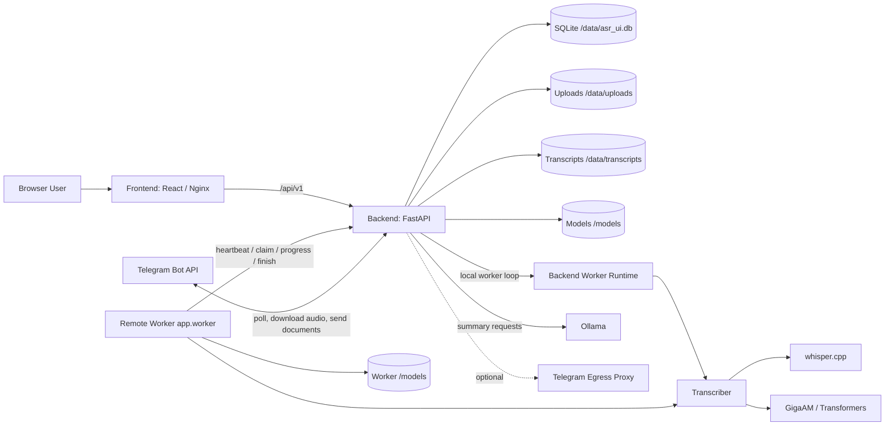
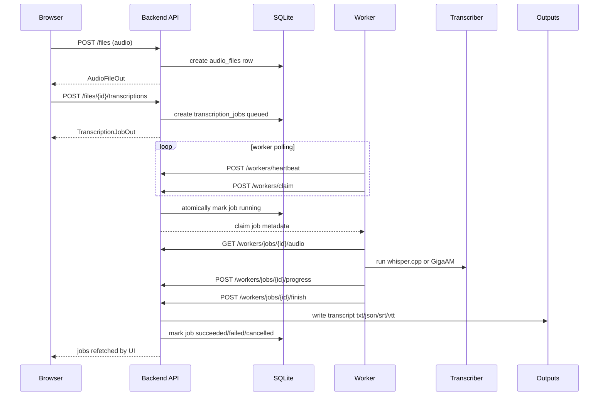
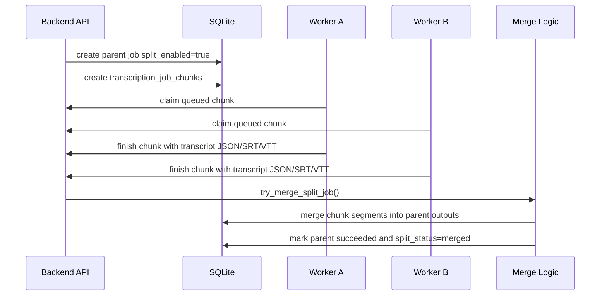
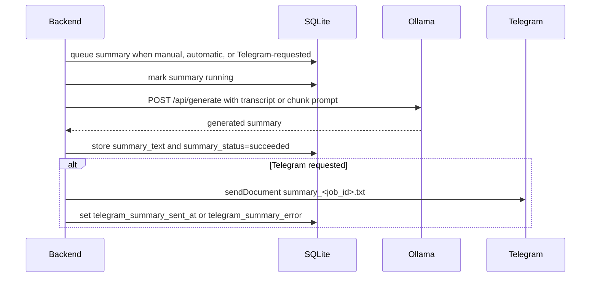
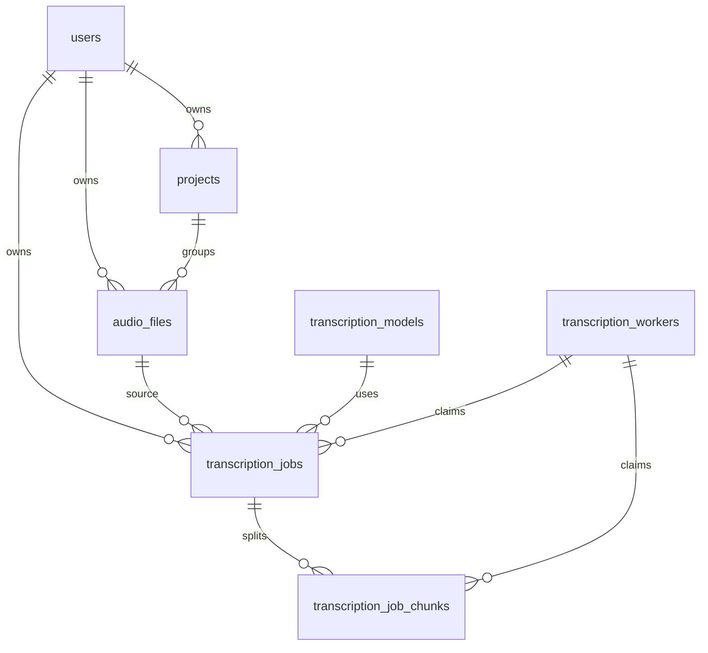

# ASR UI Architecture

This document describes the current ASR UI architecture: services, API surface, data model, dependencies, and the main runtime flows.

## System Overview

ASR UI is a self-hosted transcription system with a React frontend, a FastAPI backend, SQLite persistence, local model storage, optional remote workers, Telegram ingestion, and local Ollama-based summarization.

The backend owns authentication, API authorization, job state, model catalog state, file metadata, Telegram polling, cleanup, and the local worker loop. External worker containers or remote worker hosts can connect back to the backend through worker endpoints to claim jobs, download audio, report progress, and submit final transcript artifacts.

## Services

| Service | Runtime | Responsibility | Storage |
| --- | --- | --- | --- |
| `frontend` | Nginx serving Vite React build | Browser UI for files, jobs, models, workers, settings, users, projects, and dashboard | none |
| `backend` | FastAPI / Uvicorn | REST API, auth, SQLite access, local worker loop, Telegram bot, cleanup scheduler, model install scheduler | `/data`, `/models` |
| `worker` | Python module `app.worker` | Optional remote/discrete worker process that heartbeats, installs models, claims jobs/chunks, runs transcription, and reports results | `worker_data`, `worker_models` |
| `ollama` | Ollama container | Local summarization model serving | `ollama_data` |
| `telegram-egress-proxy` | Python module `app.tools.telegram_egress_proxy` | Optional host-network egress helper for Telegram API access | none |

## System Diagram



## Backend Startup

The FastAPI lifespan in `backend/app/main.py` initializes runtime services in this order:

1. Initialize or migrate the SQLite schema with `init_db()`.
2. Resume interrupted model installs.
3. Start the local transcription queue if `ASR_WORKER_ENABLED=true`.
4. Start Telegram polling.
5. Start the cleanup scheduler.

On shutdown, cleanup, Telegram polling, and the local transcription queue are stopped.

## API Overview

All public application routes are under `/api/v1`.

| Area | Endpoints | Purpose |
| --- | --- | --- |
| Auth | `POST /auth/register`, `POST /auth/login`, `POST /auth/refresh`, `POST /auth/logout`, `PUT /auth/change-password`, `GET /auth/me` | First-user setup, JWT cookie sessions, password changes |
| Files | `GET /files`, `POST /files`, `PATCH /files/{id}`, `GET /files/{id}/audio`, `DELETE /files/{id}`, `POST /files/{id}/transcriptions` | Upload, stream, organize, delete audio files, start transcription |
| Transcriptions | `GET /transcriptions`, `GET /transcriptions/{id}`, `POST /transcriptions/{id}/cancel`, `POST /transcriptions/{id}/summary`, `POST /transcriptions/{id}/summary/cancel`, `DELETE /transcriptions/{id}`, `GET /transcriptions/{id}/segments`, `GET /transcriptions/{id}/download` | Job listing, cancellation, summary lifecycle, transcript downloads |
| Models | `GET /models`, `GET /models/catalog`, `GET /models/stats`, `POST /models/install`, `POST /models/{id}/cancel`, `DELETE /models/{id}` | Model inventory, install/remove, performance stats |
| Workers | `GET /workers`, `PATCH /workers/{id}`, `POST /workers/{id}/install-model`, `POST /workers/{id}/uninstall-model`, `DELETE /workers/{id}` | Admin worker management |
| Worker Runtime | `POST /workers/heartbeat`, `POST /workers/claim`, `GET /workers/jobs/{id}/audio`, `GET /workers/chunks/{id}/audio`, `POST /workers/jobs/{id}/progress`, `POST /workers/chunks/{id}/progress`, `POST /workers/jobs/{id}/finish`, `POST /workers/chunks/{id}/finish`, `GET /workers/catalog` | Worker-to-backend protocol |
| Projects | `GET /projects`, `POST /projects`, `PATCH /projects/{id}`, `DELETE /projects/{id}` | Per-user audio organization |
| Users | `GET /users/`, `GET /users/stats`, `POST /users/`, `PUT /users/{id}`, `DELETE /users/{id}` | Admin user management and user stats |
| System | `GET /system/health`, `GET/PATCH /system/cleanup`, `GET/PATCH /system/summarization`, `POST /system/summarization/pull`, `GET/PATCH/POST /system/whisper-cli`, `GET/PATCH/POST /system/telegram-bot` | Health and admin settings |

Authentication is cookie-based JWT for browser APIs. Worker runtime endpoints use the configured worker bearer token.

## Transcription Sequence



## Split Job Sequence



Split chunk sizing uses worker speed history for the selected model when available. If exact model history is missing, the scheduler falls back to persisted per-model worker speed samples and then equal weighting.

## Summary Sequence



Long transcripts are chunked before summarization. Chunk summaries are merged into a final summary. Summarization is local-only through the configured Ollama base URL.

## Telegram Ingestion Flow

1. The backend long-polls Telegram `getUpdates`.
2. Incoming audio, voice, and supported audio documents are validated against allowed Telegram users.
3. Telegram files are downloaded into the same upload storage used by web uploads.
4. A queued transcription job is created with `source="telegram"` and Telegram metadata.
5. The user receives a queue confirmation.
6. When transcription finishes, the backend sends the transcript JSON as a Telegram document.
7. If summary was requested, the summary is generated and sent as a `.txt` document.

## Database Model



| Table | Role | Important Fields |
| --- | --- | --- |
| `users` | Accounts and roles | `username`, `email`, `password_hash`, `role` |
| `projects` | Per-user grouping | `owner_user_id`, `name`, `description` |
| `audio_files` | Uploaded or Telegram audio metadata | `owner_user_id`, `project_id`, `source`, `stored_path`, `size_bytes`, `duration_seconds` |
| `transcription_models` | Installed/installing model state | `provider`, `variant`, `language_mode`, `path`, `status`, `downloaded_bytes`, `total_bytes`, `is_deleted` |
| `transcription_jobs` | Parent transcription job and summary state | `status`, `transcript_text`, output paths, summary fields, Telegram fields, worker fields, split fields |
| `transcription_job_chunks` | Split transcription work units | parent job, time range, overlap, status, worker, chunk outputs |
| `transcription_workers` | Local and remote worker registry | identity, acceptance state, heartbeat, job counters, model inventory, speed stats, install requests |
| `app_settings` | JSON settings store | cleanup, whisper CLI, summarization, Telegram bot, update offsets |

## Filesystem Layout

| Path | Purpose |
| --- | --- |
| `/data/asr_ui.db` | SQLite database |
| `/data/uploads/{user_id}/...` | Uploaded and Telegram-downloaded audio |
| `/data/transcripts/{user_id}/{job_id}/...` | Transcript outputs and intermediate chunks |
| `/data/worker-cache/...` | Remote worker downloaded job/chunk audio cache |
| `/models/...` | Whisper GGML binaries and GigaAM snapshots |

## Runtime Dependencies

| Dependency | Used By | Purpose |
| --- | --- | --- |
| FastAPI / Uvicorn | backend | REST API and lifecycle |
| SQLAlchemy async / aiosqlite | backend | SQLite ORM access |
| Pydantic / pydantic-settings | backend | schemas and environment settings |
| httpx | backend and workers | Telegram, Ollama, worker API, model downloads |
| ffmpeg | backend/worker image | duration probing and audio conversion |
| whisper.cpp | transcriber | Whisper inference |
| Hugging Face Hub, Transformers, Torch, Torchaudio | transcriber | GigaAM v3 downloads and inference |
| WebRTC VAD | transcriber | speech-aware GigaAM chunk boundaries |
| Ollama | summarizer | local summary generation |
| React, Vite, TypeScript, Tailwind | frontend | web UI |
| TanStack Query | frontend | polling and API state |

## Local Test Requirements

These tests should be run locally after every code change. The fast suite checks API contracts and core state transitions. The E2E suite must run against real local services and must not mock the backend, worker, ASR runtime, Ollama, database, or filesystem.

### Fast Automated Suite

Run before every commit:

```bash
PYTHONPATH=backend python3.12 -m pytest tests
cd frontend
npm run build
```

The current pytest suite covers:

| Area | Coverage |
| --- | --- |
| Auth and ownership | first-user admin setup, login, file isolation, owner-scoped transcriptions, admin-only settings |
| Files and projects | upload metadata, project assignment, unassigned project filtering, delete behavior |
| Transcription jobs | job visibility, output deletion, partial transcript fields, segment reads |
| Split jobs | model-specific worker speed sizing, fallback speed sizing, cancellation and merge state transitions |
| Telegram settings | admin validation, allowed-user mapping, token masking |
| Summarization | settings, manual summary guards, cancellation, success/failure recording, chunking, Ollama request bounds, timeout messages |
| GigaAM chunking | chunk planning, silence-aware boundaries, fixed chunk fallback |

### No-Mock E2E Suite

Run these against a local Docker Compose stack or an equivalent local environment with real SQLite, real upload/output directories, at least one installed ASR model, a real worker loop, and a real Ollama model. Use short synthetic audio fixtures so the suite remains practical. Do not monkeypatch or mock service calls in these tests.

| Test | Steps | Expected Result |
| --- | --- | --- |
| First admin and login | Start with empty data volume, register first user, log in, call `/api/v1/auth/me` | First user is admin, session cookies work, later public registration is closed |
| Upload audio | Upload a short valid WAV/MP3 through `POST /api/v1/files` | File row exists, duration is probed, audio can be streamed back |
| Create transcription | Install or pre-seed a tiny Whisper model, queue transcription with `POST /api/v1/files/{id}/transcriptions`, wait for worker completion | Job moves `queued -> running -> succeeded`, TXT/JSON/SRT/VTT outputs exist, transcript download works |
| Create summary | Enable summarization, configure a local Ollama model, request `POST /api/v1/transcriptions/{id}/summary`, wait for completion | Summary moves `queued -> running -> succeeded`, `summary_text` is non-empty, timings are populated |
| Cancel queued transcription | Queue a job while worker is unavailable or busy, call `POST /api/v1/transcriptions/{id}/cancel` | Job becomes `cancelled`, no final transcript outputs are produced |
| Cancel running transcription | Queue a longer audio file, wait until `running`, cancel it | Job becomes `cancelled` or a clear cancellation terminal state, worker stops processing, no stale running job remains after restart |
| Reject summary for unfinished job | Queue a transcription and request summary before success | API returns a non-success response and does not create a running summary |
| Cancel running summary | Start a summary on a long transcript, call `POST /api/v1/transcriptions/{id}/summary/cancel` | Summary becomes `cancelled`, finish timestamp is set, no stale summary task remains |
| Invalid upload | Upload unsupported file type and an oversized file | API rejects the request and leaves no usable audio row |
| Unauthorized access | Create two users, upload as user A, try to read/delete/transcribe as user B | User B receives forbidden/not-found behavior and cannot access user A data |
| Worker unavailable | Stop workers, queue a transcription, wait past heartbeat timeout | Job stays queued, worker is shown offline, no false success is recorded |
| Split transcription | Run at least two accepted workers with the selected model, queue split transcription | Chunks are created, claimed by workers, merged into parent outputs, parent status is `succeeded` and `split_status=merged` |
| Split cancellation | Queue or start a split job, cancel while one chunk is running and another is queued | Queued chunks become cancelled, running chunks stop or terminally resolve, parent reaches `cancelled` |
| Telegram requested summary | With a real Telegram bot test chat, send an audio file with `/summary` caption | Job is created from Telegram, transcription result is sent as JSON document, summary is sent as `summary_<job_id>.txt` |

Recommended E2E command shape:

```bash
docker compose up -d --build
# run the no-mock E2E runner against http://localhost:8824 and http://localhost:8825
```

The repository does not currently include a dedicated browser or API E2E runner. Add one before treating the no-mock E2E suite as automated release gating.

## Security Boundaries

- Browser users authenticate with JWT cookies.
- Admin-only endpoints guard model management, system settings, workers, and user management.
- Non-admin users only see their own files, projects, and jobs.
- Workers authenticate with `ASR_WORKER_TOKEN`.
- Telegram users must be explicitly mapped in Telegram bot settings.
- Summarization and ASR inference are designed to stay local.

## Operational Notes

- The backend local worker is enabled by `ASR_WORKER_ENABLED`.
- Remote workers can run on separate hosts with `ASR_SERVER_URL` and the shared worker token.
- Workers appear as pending until accepted by an admin, except the backend local worker can be accepted by default.
- Worker online state is derived from `last_heartbeat_at` and `ASR_WORKER_OFFLINE_SECONDS`.
- Model install state is stored in both backend model rows and worker inventory JSON for remote workers.
- Startup reconciliation marks interrupted local running jobs/chunks as failed or cancelled as appropriate.
